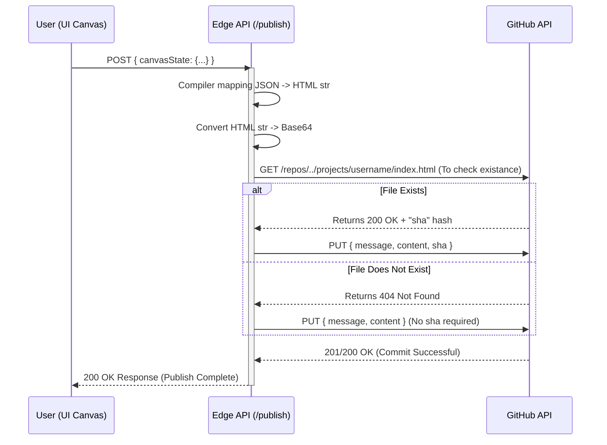

# Rakit System Architecture

This document meticulously outlines the data flows, persistence strategies, and topological architecture of the Rakit platform, as defined by its Minimum Viable Product (MVP) constraints.

## 1. Execution & Data Flow Diagrams

### High-Level System Topology

```mermaid
flowchart TD
    subgraph Client [Browser / Web Builder UI]
        User([End User]) -->|Drag & Drop Layout| Canvas[Wysiwyg Canvas (Svelte)]
        Canvas -.->|Two-way Data Binding| Store[(Svelte Store JSON State)]
        User -->|Trigger 'Publish'| PublishAction
    end

    subgraph Server [SvelteKit Server Route / Edge Runtime]
        PublishAction -->|POST JSON Payload| EndpointAPI[/api/publish]
        EndpointAPI -->|Deconstruct JSON to String| HTMLParser[HTML Renderer & String Builder]
        HTMLParser -->|Convert payload to Base64| Encoder(Base64 Encoder)
    end

    subgraph GitHub [GitHub Infrastructure - Storage Backend]
        Encoder -->|API PUT Request| GitRest[GitHub REST API]
        GitRest -->|Trigger Repository Commit| Repo[(App Data Repository)]
        Repo -.->|Automatic File Sync| RawContent[raw.githubusercontent.com CDN]
    end

    subgraph Output [Cloudflare Edge Routing - Public Visitors]
        Visitor([Hit domain.com/username]) --> EndpointProfile(Svelte Wildcard Route: /[user]/+server.ts)
        EndpointProfile -->|GET Request| RawContent
        RawContent -->|Raw Text Response| EndpointProfile
        EndpointProfile -->|Inject HTTP Header: Content-Type: text/html| Visitor
    end
```

### Typical Publish Flow (Sequence Diagram)



## 2. Structural System Components

The architectural pattern of Rakit leverages radical component decoupling to achieve operational viability at exactly $0/month infrastructure cost.

- **Presentation Layer (Frontend SvelteKit):** Functions as a highly interactive, Client-Side Rendered (CSR) Static Single Page Application serving solely as the dashboard/creator tool workspace.
- **Processing Layer (SvelteKit Edge Routes):** Handled optimally by the Cloudflare Pages Adapter. Server routes act as lightweight "Edge Compute" bridges, securely obfuscating GitHub authentication credentials without relying on traditional, paid VPS architectures.
- **Persistence Layer (Repository Filesystem):** Eliminates traditional Database Management Systems (SQL/NoSQL) completely. Instead, it utilizes standard Git version control (specifically GitHub's infrastructure). A single designated directory structurally acts as a "flat-file NoSQL Document Database" holding compiled `.html` files.
- **Delivery Layer (Dynamic SSR Rendering / Cloudflare):** Rather than users directly sharing long `raw.githubusercontent.com` URLs, Cloudflare routes proxy fetch requests instantly. The Svelte route spoofs the `text/plain` GitHub response into a standard `text/html` website, capitalizing on Cloudflare's massive global caching CDN network to drastically accelerate public availability times globally.

## 3. System Limitations & Scaling Considerations

1. **Write Propagation Latency:** Direct Git commits executed via REST APIs experience an inherent index syncing delay to the `raw.githubusercontent.com` domain. Expect caching delays bridging 1 to 5 seconds before updates reflect on the public endpoint. This falls well within the MVP target metrics.
2. **API Rate Limit Thresholds:** GitHub REST API Core enforces a strict limit (typically 5,000 API requests per hour per authenticated token). While sufficient for initial scales, significant concurrent user publishing might choke the backend. Caching GET requests via `Cache-Control` max-age headers at the Edge is mandatory to mitigate exhausting this limit from public visitor traffic hitting the proxy.
3. **Data Integrity & Security:** The designated App Data Repository MUST be configured as Private. This safeguards malicious external actors from crawling the raw user HTML database or reverse engineering the commit history. Only the authenticated SvelteKit Server Endpoints retain the broker privileges necessary to interface with this repository.
